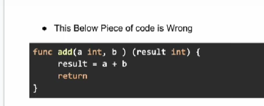

### Visibility of Identifiers(Variables, functions, types, etc)
It is determined by the case of letter of the identifier name.

Public: if a "**Identifier**" name begins with an uppercase letter it is considered as public and it is accesible from other packages.

private: if a "**Identifier**" name begins with lowercase letter it is considered as private and only accesible from within same packages.

This is the mechanism Go's way to encapsulating and controlling access to different parts of the code.
💡**Note**: private identifier's scope is the **package** itself, not the file.  This means that a private identifier declared in one file within a package is accessible from other files within the same package.

### Example

```go
package mypackage

// PublicVar is a public variable, accessible from other packages
var PublicVar int


// privateVar is a private variable, only accessible within mypackage
var privateVar string

// PublicFunc is a public function
func PublicFunc() {
	// Function implementation
}

// privateFunc is a private function
func privateFunc() {
	// Function implementation
}

// MyStruct is a public struct
type MyStruct struct {
	// PublicField is a public field
	PublicField int
	// privateField is a private field
	privateField string
}
```

---
### String formatting in _FMT_ package

### 1.Printf:
The **Printf** Function is used to print the formatted string to the console.
```go
fmt.Printf("%d", 33)	// 33
```
### 2. Sprintf
The Sprintf is used for creating and returning the string in golang. It is used for creating a formatted string without having to print it.
```go
s1 := fmt.Sprintf("%d", 35) //create the string
fmt.Println(s1) //35
```
String Formatting Verbs

| VERB                        | Description                                                                 |
|-----------------------------|-----------------------------------------------------------------------------|
| %v                          | print the value in default type                                             |
| %d                          | int, int8, etc.                                                             |
| %t                          | used for boolean values                                                     |
| %g                          | float values                                                                |
| %d, %#x if printed with %#v | uint, uint8, etc                                                            |
| %P                          | Used for Pointer                                                            |
| %s                          | Used for string                                                             |
| %d                          | Used for base 10                                                            |
| %b                          | Base2                                                                       |
| %c                          | Used for representing a character by using the Unicode                      |
| %o                          | used for base 8                                                             |
| %O                          | used for base 8 with Oo prefix                                              |
| %x                          | Used for base 16, generally, for lower case letters, a-f                    |
| %X                          | Used for base 16, generally, for upper case letters, A-F                    |
| %q                          | It is used for single quote character literal                               |
| %U                          | Used for Unicode format, generally U+1234; same as "U+%04X"                 |
| %s                          | Used for the uninterpreted bytes of the slice or string                     |
| %q                          | It is used for a double-quoted string that is safely escaped with Go syntax |                                  |

---
### Function in Go!
**1. Regular functions:**  These are the most common type, defined with a name, parameters, and a return type (or void if no return).
Go
```go
 func add(a int, b int) int {
        return a + b
    }
//Or we can write same function with a return type name
func add(a int, b int) (result int) {
    result = a+b
	return result
}
//you will get same output here 
```
### **💡Note:**  int in the return is showing a single return type 
**2. Anonymous Functions (Closures):**   These functions are defined without a name and can be assigned to variables or passed as arguments to other functions. They can "close over" and access variables from their surrounding scope.
```go
add:= func(a int, b int) int {
	return a+b
}
```
**3. Variadic Functions:** These functions accept a variable number of arguments of the same type, using the ... syntax.
```go
func sum(nums ...int) int{
	total:=0
	for _, num := range nums{
	    total += num	
    }   
	return total
}
```
Here all argument have same type so write their type in last as shown int comes after c
```go
func sumofInt(a,b,c int) int{
	total:=0
	for _, num := range nums{
	    total += num	
    }   
	return total
}
```
**4.Higher-Order Functions:** These functions can take other functions as arguments or return functions as results, enabling functional programming paradigms.
```go
func operate(a int, b int , operation func(int, int) int) int {
	return operation(a,b)
}
```
**5. Methods:** These are functions associated with a spcific type(struct or custom type), and work on instance of that type.
```go
type Circle struct {
	radius float64
}
func (c Circle) area() float64{
	return 3.14 * c.radius * c.radius
}
```
**6. Function Types:** In Go, functions are first-class citizens and can be defined as types. This allows for more flexible function usage and can improve code readability.
```go
type MathOperation function(int, int) int

func calculate(a int, b int, op MathOperation) int{
	return op(a,b)
}
```
**7.Main Function:** This special function serves as the entry point for the execution of a Go program.
```go
   func main() {
        // Program logic here
    }
```
**8.Assembly functions**: Go programs can call assembly language functions.
```go
// in assembly file my_assembly.s
// TEXT ·MyFunction(SB),$0-16
//  MOVQ x+0(FP), AX
//  MOVQ y+8(FP), BX
//  ADDQ BX, AX
//  MOVQ AX, ret+16(FP)
//  RET

// in go file
package main

import "fmt"

//go:noinline
func MyFunction(x, y int64) int64

func main() {
	a := int64(10)
	b := int64(20)
	result := MyFunction(a, b)
	fmt.Println(result) // Output: 30
}
```

### Extra


**9. Function with Error handling**
```go
func divide(a,b float64) (float64, error) {
	if b==0 {
		return 0, fmt.Errorf("denominator must be zero")
    }
    return a/b, nil
}
func main(){
	ans, _ := divide(10,0)
	fmt.Println("Division of two numbers is", ans)
}

//another way to use it is 
func main(){
ans, err := divide(10,0)
if err != nil{
	fmt.Println("Error Handling")
}
fmt.Println("Division of two numbers is", ans)
}
```
💡**Note:** Here _ (underscore) is the blank identifier which takes error if occured, we can use err variable or something else but it show error like "**err declared and not used**", so go provide the blank Identifier to get the value but not use it.
Or if we want to handle error we can use any identifier name like errr and handle it in if block
